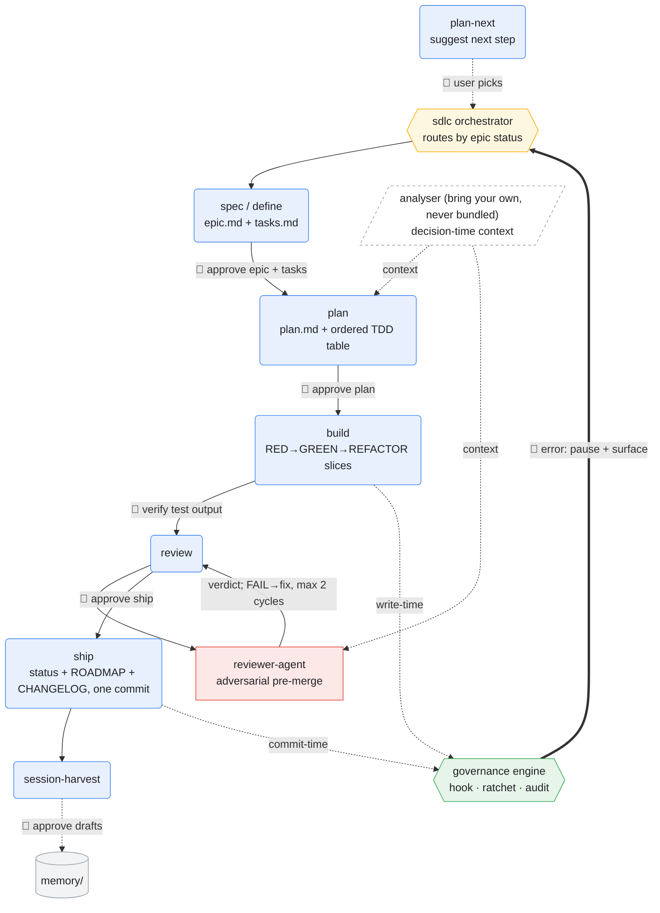

# Architecture

One principle: deterministic gates around probabilistic generation. Authored once in a tool-agnostic source, emitted per-tool at the strongest enforcement each tool supports.

## The shape

```
canonical/  (one tool-agnostic source of truth per skill / agent / rule)
   ▼ emitter (claude-code, cursor, copilot; codex/aider/continue in v0.2)
.claude/skills/, .cursor/rules/, .github/instructions/, ...
   ▼ each tool reads its own format
FACTORY (skills + subagents + ADRs + harvest)   produces work
   ▼ work passes the gates
GOVERNANCE ENGINE (YAML rules + hook + ratchet)  gates the work
   ▼
PRODUCT (what the team ships)
```

**Factory.** The SDLC machine. Takes intent ("ship feature X") and produces shipped artefacts: a PR with tests, an ADR, harvested session memory. Composed of skills (named playbooks the agent invokes) and subagents (adversarial reviewers run inline). Proactive: it generates right.

**Governance engine.** The rule enforcement layer. Gates what the factory produces: a YAML rule contract, a hook, and a ratchet that refuses to let warning counts grow. Reactive: it blocks bad agent moves before they land.

The two compose. The factory produces; the governance gates. The product is what falls out the top.

## Canonical layer (the source of truth)

`canonical/` holds one tool-agnostic spec per skill, agent, and governance rule. Each spec declares capability requirements in frontmatter (`requires.hook_intercept`, `requires.subagent_invocation`, etc.). Emitters resolve those requirements against `canonical/tool-capabilities.yaml`:

- Tool supports the capability: the spec emits in full.
- Tool lacks it but a `degrades_to:` is declared: the spec emits in a degraded form (e.g. `hook_intercept` degrades to `commit_time_gate` for Tier 2/3 tools).
- Tool lacks it with no fallback: the spec is skipped for that tool.

Concretely, the `requires:` block of `canonical/skills/sdlc.md`:

```yaml
requires:
  llm_inline_invocation: { level: required, degrades_to: glob_applied_rule }
  filesystem_writes:      { level: required }
  session_lifecycle_hooks:{ level: preferred, degrades_to: manual_invocation }
```

On Claude Code (`tool-capabilities.yaml` says `llm_inline_invocation.supports: true`) this emits as a real `/sdlc` skill. On Cursor (no inline invocation) the same spec emits as a glob-applied rule via the declared `degrades_to`. One source, two shapes, zero divergence.

The result: a team using Cursor + Claude Code + Copilot on one repo authors discipline once. Each member's tool gets the right configs auto-emitted into the repo. Same standards across the team; different IDEs.

`canonical/` is the **sole** source of truth. There are no hand-maintained per-tool files; the old root `skills/` and `agents/` directories were removed once the Claude Code emitter shipped (closed friction F8). Emitted output is regenerable, not committed in this repo. See `canonical/emitter-contract.md` for what every emitter must satisfy, and ADR-0003 for the canonical spec format.

## The five layers

### 1. Skills

Named, file-on-disk playbooks. The source is `canonical/skills/<name>.md`; the Claude Code emitter renders each to `.claude/skills/<name>/SKILL.md`. An agent invokes `/plan` and reads the playbook; the playbook tells the agent what artefacts to produce, what gates to pass, what to log.

The scaffold ships **12 skills + 1 subagent**:

- `sdlc`: the umbrella; orchestrates the others
- `spec`: capture intent as epic + tasks (scales internally: inline tasks for 1-2 components, per-component specs for 3+; `define` was merged in per ADR-0006)
- `plan`: read-only Plan Mode, then an ordered TDD task table with dependency map + risks
- `plan-next`: pick the next concrete step from a plan
- `build`: the instructional TDD runner; execute the task table one RED, GREEN, REFACTOR slice at a time
- `debugging-and-error-recovery`: stop-the-line root-cause debugging; reproduce with a failing test before fixing
- `performance-optimization`: measure-first; fix only the proven bottleneck; guard against regression
- `review`: run review on a diff before ship
- `refactor`: execute a refactor with rollback discipline
- `audit`: human-facing narration over the rules engine + hook diagnostics (not a second review)
- `session-harvest`: flush durable knowledge into memory at session close
- `scaffold`: bootstrap or adopt the kit into a project (detect tools, run emitters, seed shared files)

Each is a markdown file the agent reads and follows; the skill body is not interpreted as code. The skill set is *hierarchical*: `sdlc` orchestrates phase dispatch by epic status; `plan-next` selects cross-feature work; the other skills sit under those two. Comparative analysis vs flat agentic-coding skill models: [`docs/findings/comparison-vs-flat-skill-models.md`](docs/findings/comparison-vs-flat-skill-models.md).

### 2. Subagents

Adversarial reviewers. Different model session, narrower scope, blunter feedback. `canonical/agents/reviewer-agent.md` is the template the scaffold ships. The factory's `review` skill invokes the subagent; the subagent's verdict gates merge.

### 3. ADRs (Architecture Decision Records)

Dated, immutable. `docs/decisions/0042-some-decision.md`. Frontmatter has `Status`, `Date`, `Supersedes`. Body has Context, Decision, Consequences. New decisions get the next free number; numbers are never reused. Supersession is explicit: the old ADR's Status changes to "Superseded by 00NN". ADRs preserve the *why* of past decisions so the next session does not relitigate.

### 4. Governance engine

A YAML rule contract:

```yaml
rules:
  - id: R7_jsdoc_on_exports
    severity: warn
    description: Exported functions must have JSDoc
    enforcement: [hook, engine]
    check: jsdoc_on_exports
    scope: "src/**"
```

A hook (`governance/hook.example.sh`, wired to the engine) intercepts Edit/Write tool calls, evaluates the rules against the proposed change, and allows, warns, or blocks. A ratchet refuses commits that grow the warning count beyond the recorded baseline: existing warnings are grandfathered, new ones are not. Three severities: `error` (block), `warn` (allow but count), `audit` (record only).

### 5. Memory

Per-project markdown files at `memory/*.md`, indexed by `MEMORY.md`. Memory holds non-derivable context (user preferences, project history, calibration constants) that future sessions need but cannot recompute from the codebase. The `session-harvest` skill flushes durable knowledge into memory at session close. Memory grows organically.

## The SDLC flow and its human gates

The components above compose into one loop. Probabilistic generation runs between deterministic gates, and a human approves at every phase boundary (🧑 below): the agent never advances the epic state on its own. Node colour is the component type; dashed edges are governance / analyser couplings; `🧑` marks a human-in-the-loop (HIL) checkpoint.



**The seven human gates.** `plan-next` only suggests (the user picks the epic); `spec` waits for epic + tasks approval; `plan` waits for plan approval; `build` lands per-slice but the user verifies the test output before the status flips; the `reviewer-agent` verdict gates human review (FAIL routes back to build, capped at 2 cycles); `review` waits for ship approval; `session-harvest` drafts memory + ADR triggers for approval, never auto-committing; and any new governance *error* pauses the loop and surfaces to the user rather than blocking silently. The deterministic surfaces (the governance hook at write-time, the ratchet at commit-time) need no human; they are the automatic floor under the human gates.

## The dogfood loop

A factory that ships an analyser should run that analyser on its own diffs:

1. The factory's `review` skill is invoked on a proposed change.
2. `review` calls the analyser (RepoNav, or your tool of choice) on the diff.
3. The analyser emits architecture context: what the diff touches, what depends on it, where the seams are.
4. The subagent reviewer reads the analyser output as part of its evidence.
5. Governance rules (e.g. "no new boundary violation") read from the same analyser output.
6. If the analyser flags a regression in its own source, the factory remediates through the same pipeline.

This is what makes the case-study evidence non-trivial: the tool that measures correctness is the same tool used to produce the codebase that gets measured. The measured result is bounded, though: it scores one architectural decision on one refactoring fixture with the summary primed fresh at decision time, so it proves context-at-decision-time, not the whole loop (see [README.md](README.md) section "What this measures, and what it does not"). The analyser is the case study's reference implementation, never bundled into this kit; the scaffold ships analyser-agnostic and the formal interface contract is a v0.2 ROADMAP item.

## Where this scaffold ends

The scaffold ships shapes for project-specific contents, plus a small working core enabled by default (ADR-0007):

- The ADR *template*, not the dozens of ADRs of any one project.
- A **Universal Default Set** of governance rules (test-first, no-secrets, scope-containment, doc-validity, skill-size) ships *enabled*: advisory under the `solo` profile, ramping to blocking under `team`. Project-specific rules (boundary imports, domain invariants) ship as commented *shape*, not enabled. ADR-0001's "do not ship one project's rules as universal" guard governs that second set; ADR-0007 records why the universal subset is consensus hygiene, not opinion.
- The skill *playbooks*, not project-specific predicates.

Customisation happens at adoption time: add your project-specific rules, write ADRs as decisions land, run `session-harvest` at session close. The universal core works on clone (a planted violation actually fires a gate); the project-specific contents are yours. See ADR-0007 and `governance/governance.yaml.example`.

## Non-goals

- **Not a service or SDK.** No background daemon, no network calls, no `import` statements you wire into your application code. The engine and emitters are local CLIs you invoke on demand; the hook (when installed) gates Edit/Write actions in the agent's tool layer. See [ADR-0008](docs/decisions/0008-not-a-runtime-language-reconciliation.md) for the language reconciliation against the v0.1.0 framing.
- **Not opinionated about your analyser.** RepoNav is one option (the case study); use any tool that produces deterministic architecture context. The analyser is never bundled here. The formal interface contract is a v0.2 ROADMAP item.
- **Not a contribution apparatus in v0.1.** Issues welcome; PRs reviewed at maintainer discretion. No support SLA. See [CONTRIBUTING.md](CONTRIBUTING.md).
